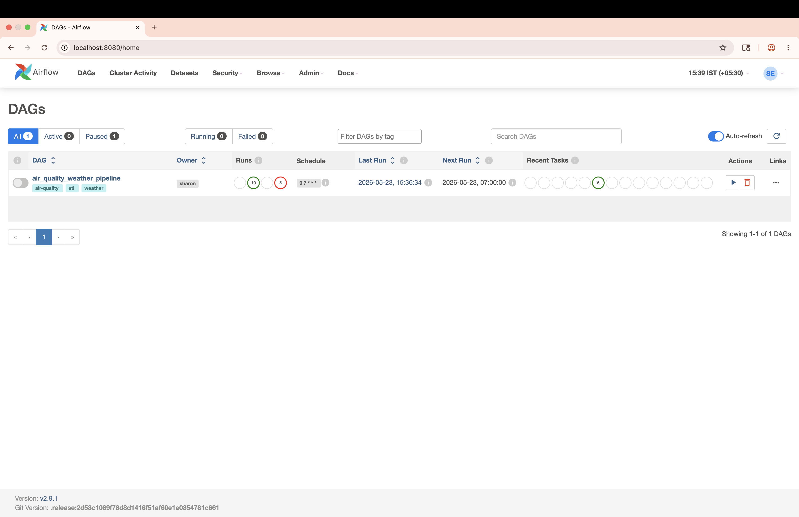
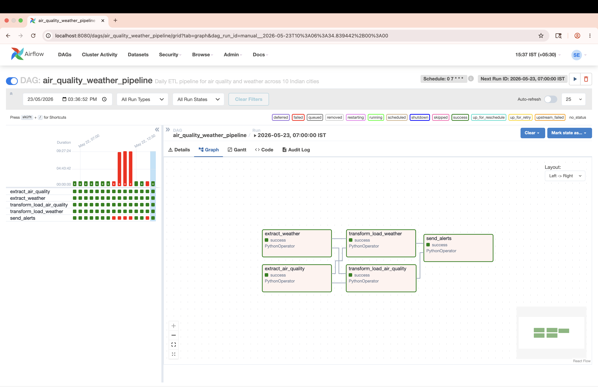
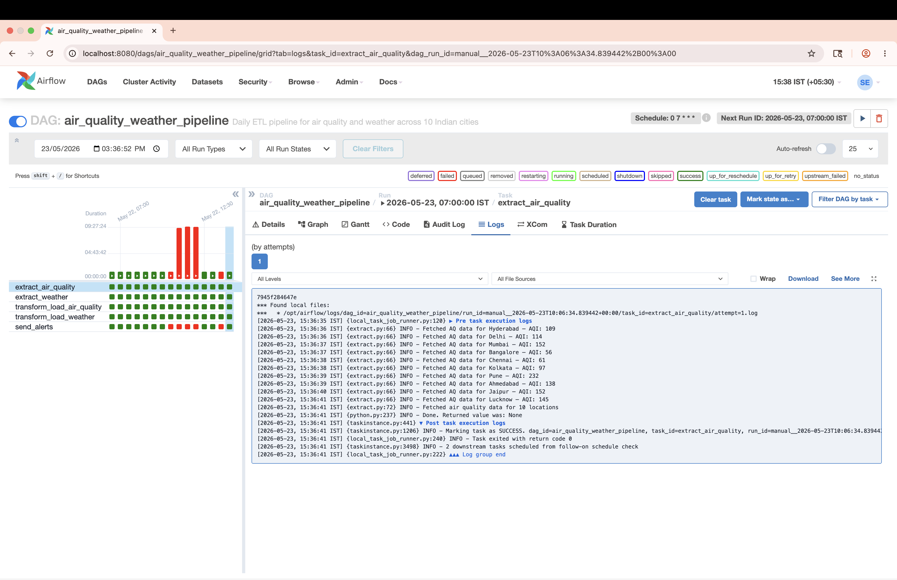
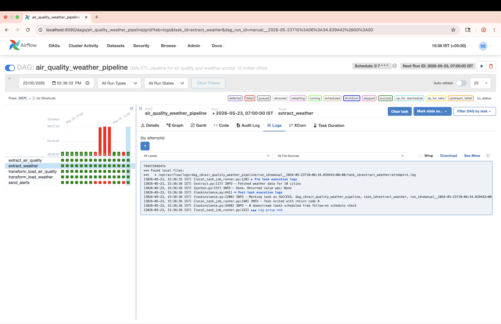
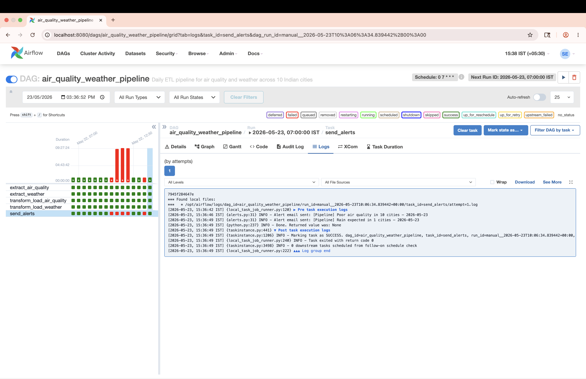
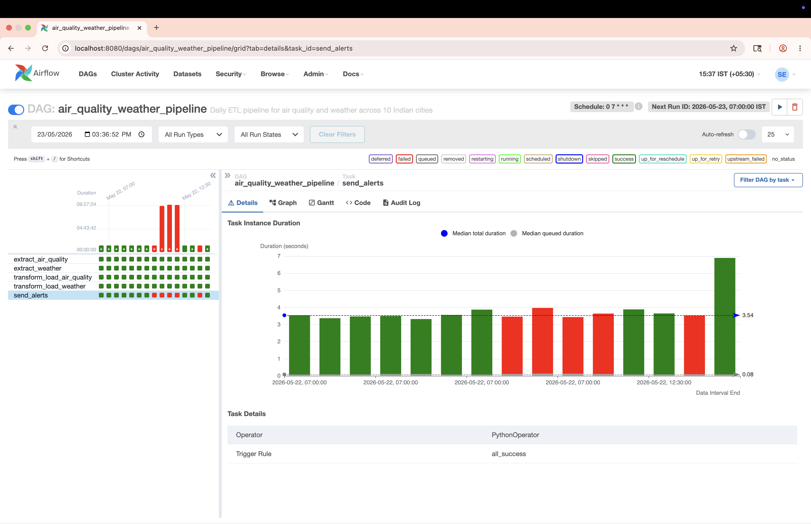
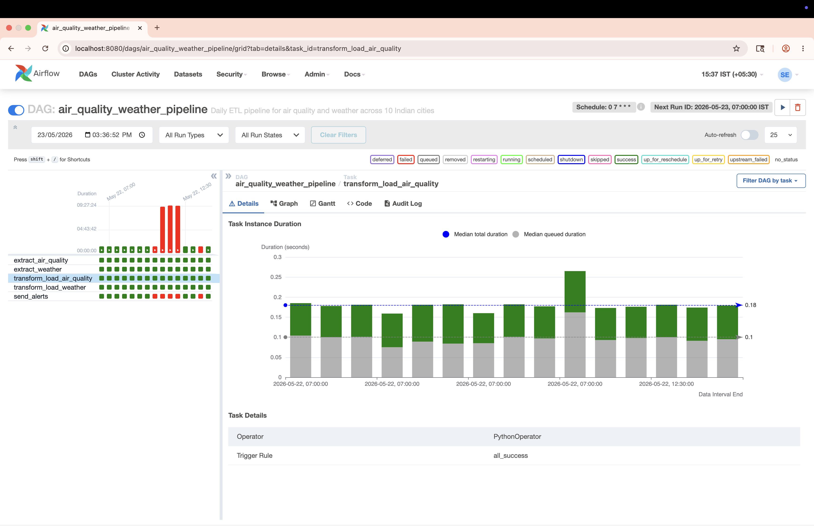
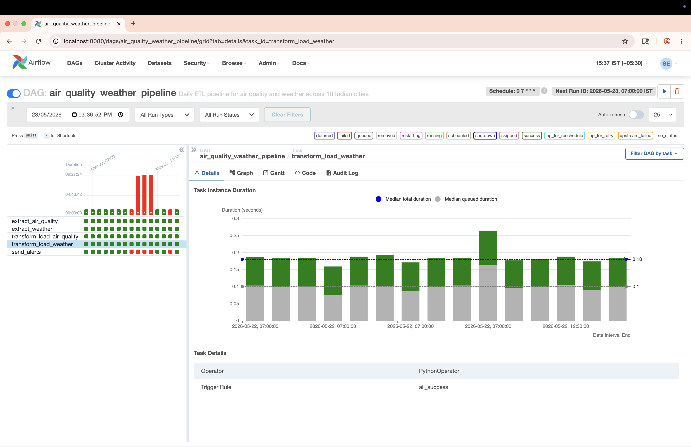
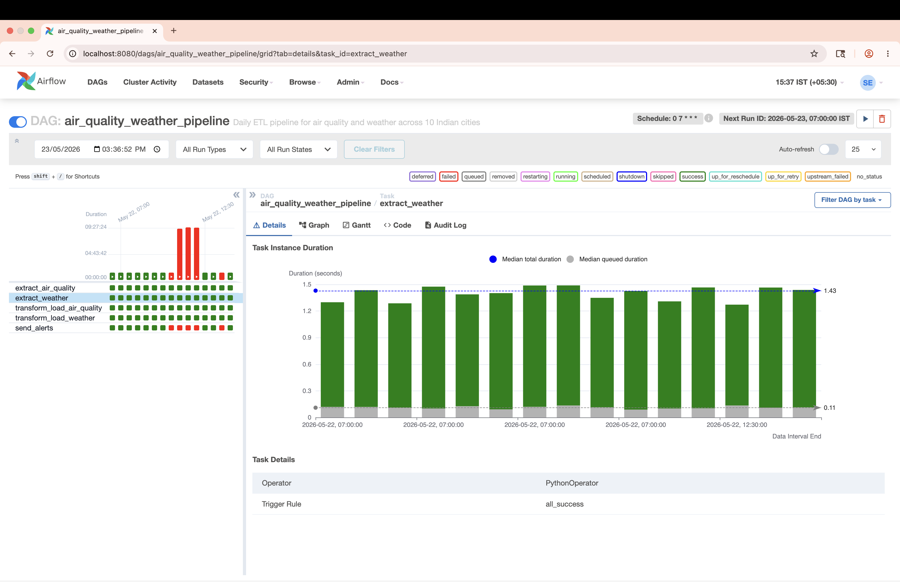

# Air Quality and Weather ETL Pipeline

An automated data engineering pipeline that ingests real-time air quality and weather data for 10 Indian cities daily, loads it into PostgreSQL, and delivers intelligent email alerts for poor air quality and rain forecasts.

## Live Pipeline Screenshots











## Problem Statement
Air quality and weather data across Indian cities is fragmented across multiple sources and updated continuously. Manual monitoring doesn't scale. This pipeline automates multi-source ingestion, transformation, and stakeholder alerting — directly applying enterprise data engineering patterns to a real-world environmental monitoring use case.

## Architecture
Daily at 7:00 AM IST (Airflow triggers):
├── Task 1: Extract air quality data — 10 cities (WAQI API)
├── Task 2: Extract weather forecast — 10 cities (OpenWeatherMap API)
├── Task 3: Transform and load air quality → PostgreSQL
├── Task 4: Transform and load weather → PostgreSQL
└── Task 5: Evaluate thresholds and send alerts
├── Rain alert    → cities with rain probability > 60%
├── AQI alert     → cities with PM2.5 in Unhealthy range
└── Failure alert → any task that fails

## Tech Stack
· Python
· Apache Airflow 2.9 
· PostgreSQL 15 
· Docker 
· WAQI API 
· OpenWeatherMap API

## Features
- Multi-source ingestion from two independent REST APIs
- 5-task Airflow DAG with parallel extract tasks and dependency chaining
- PostgreSQL backend with 3 tables: air_quality, weather_forecast, pipeline_logs
- 3 automated email alert types: rain forecast, AQI threshold, pipeline failure
- Full pipeline logging — every run recorded with status and record count
- Covers 10 Indian cities: 
· Hyderabad
· Delhi
· Mumbai
· Bangalore
· Chennai
· Kolkata
· Pune
· Ahmedabad
· Jaipur
· Lucknow

## Cities Monitored
| City | State | Why Included |
|---|---|---|
| Hyderabad | Telangana | Home city — personal relevance |
| Delhi | NCT | Worst AQI in India — always critical data |
| Mumbai | Maharashtra | Coastal weather patterns |
| Bangalore | Karnataka | Tech hub, distinct climate |
| Chennai | Tamil Nadu | Hot and humid baseline |
| Kolkata | West Bengal | Monsoon patterns |
| Pune | Maharashtra | Near Mumbai, different AQI profile |
| Ahmedabad | Gujarat | Industrial pollution data |
| Jaipur | Rajasthan | Arid climate contrast |
| Lucknow | Uttar Pradesh | North India pollution belt |

## Database Schema
```sql
air_quality      — city, pm25, pm10, no2, co, aqi_category, measured_at
weather_forecast — city, temperature, humidity, rain_probability, rain_expected
pipeline_logs    — task_name, status, records_processed, error_message
```

## Alert System
| Alert | Trigger | Delivery |
|---|---|---|
| Rain Alert | Rain probability > 60% | Email with city, temperature, humidity |
| AQI Alert | PM2.5 category Unhealthy or worse | Email with PM2.5, PM10 per city |
| Failure Alert | Any Airflow task fails | Email with task name and error |

## Sample Alert Output
See [AQI Alert PDF](screenshots/AQ_alert.pdf) and 
[Rain Alert PDF](screenshots/Rain_alert_22.pdf) and [Rain Alert PDF 2](screenshots/Rain_alert_23.pdf) for real pipeline output.

## Project Structure
├── dags/
│   ├── air_quality_dag.py   ← Airflow DAG — 5 tasks, daily schedule
│   ├── extract.py           ← WAQI + OpenWeatherMap API calls
│   ├── transform.py         ← Data cleaning, AQI categorisation
│   ├── load.py              ← PostgreSQL insert operations
│   └── alerts.py            ← Email alert logic (3 alert types)
├── screenshots/             ← Pipeline screenshots and alert PDFs
├── docker-compose.yml       ← Airflow + PostgreSQL containers
├── init_db.sql              ← Database schema initialisation
└── requirements.txt

## How to Run

### Prerequisites
- Docker Desktop installed and running
- WAQI API key (free at aqicn.org/data-platform/token)
- OpenWeatherMap API key (free at openweathermap.org)
- Gmail account with App Password enabled

### Setup
```bash
# Clone the repository
git clone https://github.com/Sharonevangeline/air-quality-pipeline.git
cd air-quality-pipeline

# Create .env file with your credentials
cp .env.example .env
# Edit .env with your API keys and email credentials

# Start all containers
docker compose up airflow-init
docker compose up -d

# Open Airflow UI
open http://localhost:8080
# Login: admin / admin
```

### Environment Variables
OPENWEATHER_API_KEY=your_key
WAQI_API_KEY=your_key
ALERT_EMAIL_FROM=your_gmail
ALERT_EMAIL_TO=your_gmail
ALERT_EMAIL_PASSWORD=your_app_password
POSTGRES_USER=airflow
POSTGRES_PASSWORD=airflow
POSTGRES_DB=airflow
POSTGRES_HOST=postgres
POSTGRES_PORT=5432

## Motivation
Built to demonstrate end-to-end data engineering skills — multi-source 
ingestion, pipeline orchestration, and automated monitoring — directly 
extending the ETL and workflow orchestration work done professionally 
at Accenture. The environmental domain was chosen for its social relevance 
and data complexity: Indian air quality stations report inconsistently, 
requiring robust error handling and graceful degradation.
